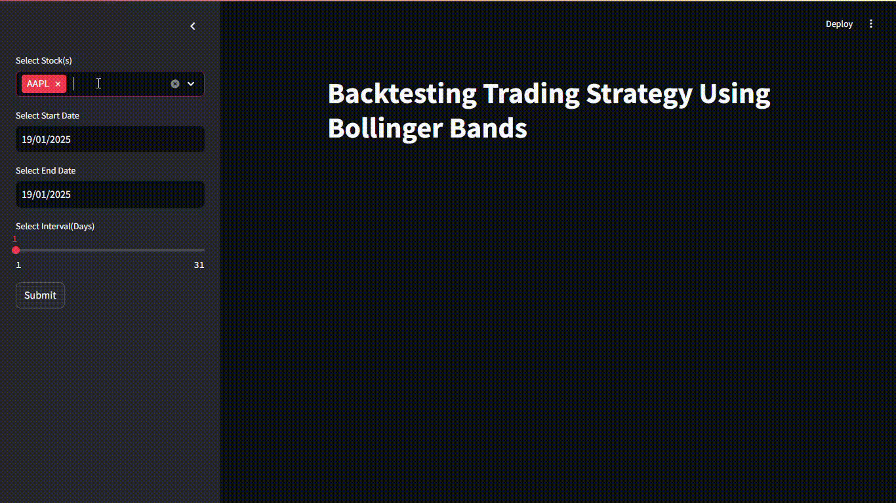

<p align="center">
	
	
	
	
</p>

# Bollinger Bands Stock Backtesting



A stock backtesting application that evaluates trading strategies based on Bollinger Bands. This interactive tool visualizes stock trends, generates trade signals, and provides insights into historical stock performance. Built with Streamlit for a user-friendly interface and Plotly for dynamic charting.

## Features

- **Multi-stock Backtesting**: Analyze up to 50 stocks simultaneously.
- **Interactive Graphs**: Visualize Bollinger Bands, SMA, trade signals, and trends for each stock.
- **Custom Parameters**: Adjust start/end dates and interval to refine analysis.
- **Carousel Display**: Easily navigate through multiple stock graphs.
- **Trade Insights**: Tabular view of trades including Buy/Sell signals.

## Technologies Used

- **Python**
- **Streamlit**: For creating an interactive user interface.
- **Plotly**: For generating dynamic and interactive charts.
- **Streamlit-Carousel**: For navigating through multiple stock graphs.

## Installation

1. Clone the repository:
    ```bash
    git clone https://github.com/amMistic/Bollinger-Bands-Stock-Backtesting.git
    ```
2. Navigate to the project directory:
    ```bash
    cd <directory name>
    ```
3. Set up a virtual environment:
    ```bash
    python -m venv .venv
    source .venv/bin/activate # On Windows: .venv\Scripts\activate
    ```
4. Install the dependencies:
    ```bash
    pip install -r requirements.txt
    ```

## Usage

1. Start the Streamlit application:
    ```bash
    streamlit run app.py
    ```
2. Open your web browser and navigate to:
    ```
    http://localhost:8501
    ```
3. Select stocks, dates, and interval from the sidebar, then click **Submit** to view the results.

## File Structure

```
Boilling-Bands-Stock-Backtest/
├── .venv/
├── assets/
│   └── demo_BBTStocks.gif 
├── data/
│   └── user_1901202516/
├── src/
│   ├── __init__.py
│   ├── backtest.py
│   ├── bollinger_bands_strategy.py
│   ├── data_ingestion.py
│   ├── data_visualization.py
│   └── process.py
├── tests/
│   ├── __init__.py
│   ├── test_backtest.py
│   ├── test_bollinger_bands_strategy.py
│   └── test_data_ingestion.py
├── .gitignore
├── app.py
├── Readme.md
└── requirements.txt

```

## Example Workflow

1. Select stocks of interest from the provided list or choose "SELECT ALL."
2. Define the start date, end date, and interval for analysis.
3. Click **Submit** to:
    - View interactive charts displaying Bollinger Bands and trade signals.
    - Explore trade data in a table format.
4. Use the carousel feature to browse multiple stock graphs.

## Bollinger Bands Explanation

Bollinger Bands are a technical analysis tool that consists of:
- **Upper Band**: SMA + (standard deviation * multiplier).
- **Lower Band**: SMA - (standard deviation * multiplier).
- **SMA (Simple Moving Average)**: Average of the closing price over a specific period.

**Trade Signals:**
- **Buy**: When the price crosses 3% below the lower band.
- **Sell**: When the price crosses above the upper band.

## Contribution

Feel free to open issues or submit pull requests if you'd like to contribute to this project.

